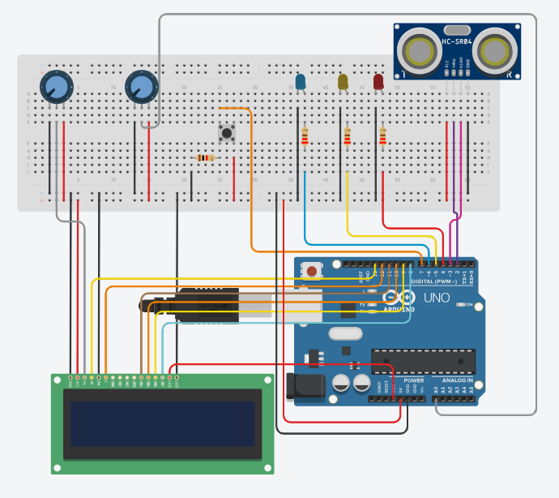

# Arduino Demo Prototype

## Setup

### Firmata Installation

Open the Arduino IDE and go to Tools -> Manage Libraries.  
Search for FirmataExpress by Alan Yorinks.  
Click Install.

### Running Firmata

Open the Arduino IDE and go to File -> Examples -> FirmataExpress -> FirmataExpress.  
Compile and upload the sketch to the Arduino Uno.  
Keep this sketch running to interface with the Arduino

### Running Python code

Open a terminal instance, clone the repository and cd to its directory.  
Create a virtual environment with `python -m venv venv`  
Activate the virtual environement with `./venv/Scripts/Activate.bat` for powershell or `source venv/bin/activate` for Mac or Linux  
Run the system with `python system.py`

## System Operation

The push button simulates turning the ignition on and off - as indicated by the blue LED.  
Holding down the button for at least 1 second toggles the state of the ignition (and LED).  

The metal potentiometer simulates the engine speed - turning it increases the speed.  
Values are mapped from 0 - 1023 to 0 - 5000 rpm when sent through DIG.  
Engine speed is logged every 2.5 seconds.*  

The LCD displays the raw input of the metal potentiometer.  
The small blue potentiometer changes the contrast on the LCD.  

The ultrasonic sensor simulates the odometer - since the behaviour can be unpredictable, spikes of over 200 cm are cleaned from the data.  
The yellow and red LEDs indicate speeding, they turn on if the values detected by the ultrasonic sensor change too quickly.  
Yellow represents speeding above the posted limit, while red represents speeding over the maximum threshold.  
Speeding is logged at a maximum rate of 1 log per 3 seconds to prevent the same speeding instance being sent multiple times.
Odometry is logged every 10 seconds with curve logging, limited to 6 points per log.*  

*In reality, because of delay, the system runs ~2.5 times slower than expected - so 10 seconds is closer to 25 seconds

## Pinout

0 = RK (don't use)  
1 = TK (don't use)  
2 = Trig - ultrasonic sensor  
3 = Echo - ultrasonic sensor  
4 = red LED - indicates speeding over max threshold  
5 = yellow LED - indicates speeding  
6 = blue LED - indicates ignition state  
7 = button - simulates turning on ignition  
8 = D7 - LCD  
9 = D6 - LCD  
10 = D5 - LCD  
11 = D4 - LCD  
12 = E - LCD  
13 = RS - LCD  

## LCD

VSS, RS, and K to ground  
A to 3.3V

LCD sometimes sends gibberish because the python library's initialization is unpredictable.  
If this occurs, open the lcd_test.ino sketch in the Arduino IDE and upload it to the Arduino UNO (make sure you install the LiquidCrystal Arduino library).  
If the Arduino is behaving normally, this should've fixed the issue and you can run the Firmata sketch again.  

## Schematic

Since there aren't enough male-to-male wires, male-to-female wires were used to connect the LCD.

